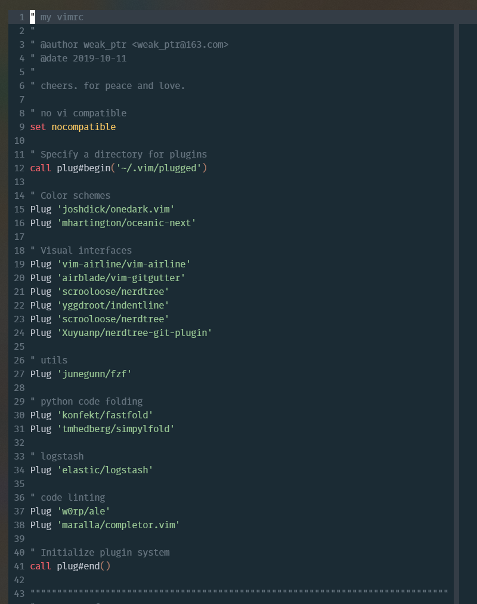

# vimrc

my vimrc configure

## plugin manager

vim-plug

## ui

- colorscheme: oceanicnext
- status: vim-airline
- navigation
  - nerdtree
  - nerdtree-git-plugin
- visual indent:
  - indentline
- gutter:
  - git-gutter

## language support

- logstash
  - elastic/logstash
- python
  - completor
  - ale(flake8)

## key binding

- leader key: ,
- new tab: ,t
- next tab: ,n
- previous tab: ,p
- fzf: ,f
- write: ,s

- code format(alefix): F9
- previous error(aleprevious): F7
- next error(alenext): F8
